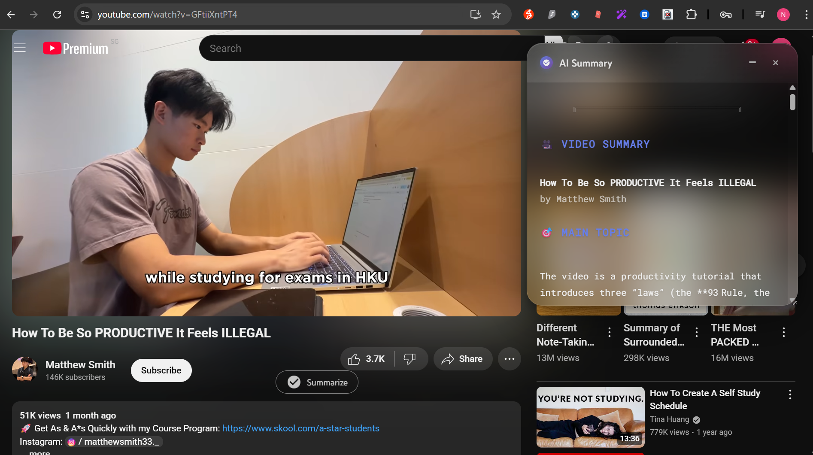

# 📺 YouTube AI Video Summarizer

Generate AI-powered summaries directly on YouTube with beautiful glassmorphism UI!

## ✨ Features

- 🎯 **One-Click Summarization** - Simple button next to like/share buttons
- 🤖 **AI-Powered** - Uses OpenRouter's free GPT-OSS-20B model  
- ✨ **Beautiful UI** - Glassmorphism design with blur effects
- 🔄 **Auto-Transcript** - Extracts transcripts using Supadata API
- 📱 **Responsive** - Works on desktop, tablet, and mobile
- 🔒 **Privacy First** - All processing happens locally

## 🚀 Installation

### Chrome Web Store (Recommended)
[Install from Chrome Web Store](https://chromewebstore.google.com/detail/mdlhkoefahbnnlgkmiicjhnadmmigofb)

### Manual Installation
1. Clone this repository
2. Open `chrome://extensions/`
3. Enable "Developer mode"
4. Click "Load unpacked" and select the folder

## 🎯 Setup

1. **Get API Keys**:
   - [Supadata API](https://supadata.ai) - for transcript extraction
   - [OpenRouter API](https://openrouter.ai) - for AI summarization (free)

2. **Configure**: Click extension icon and enter your API keys

3. **Use**: Go to any YouTube video and click "Summarize"!

## 🔧 How It Works

1. Detects YouTube videos and adds summarize button
2. Extracts transcripts via Supadata API
3. Generates AI summaries using OpenRouter
4. Displays in beautiful glassmorphism UI below video

## 🔒 Privacy & Security

- ✅ No data collection or tracking
- ✅ API keys stored locally in Chrome
- ✅ Encrypted HTTPS connections only
- ✅ Open source and transparent

## 🤝 Contributing

1. Fork the repository
2. Create feature branch (`git checkout -b feature/name`)
3. Commit changes (`git commit -m 'Add feature'`)
4. Push to branch (`git push origin feature/name`)
5. Open Pull Request

## 📝 License

MIT License - see [LICENSE](LICENSE) file for details.

---

**Made with ❤️ by [Naveen U](https://github.com/unaveenj)**