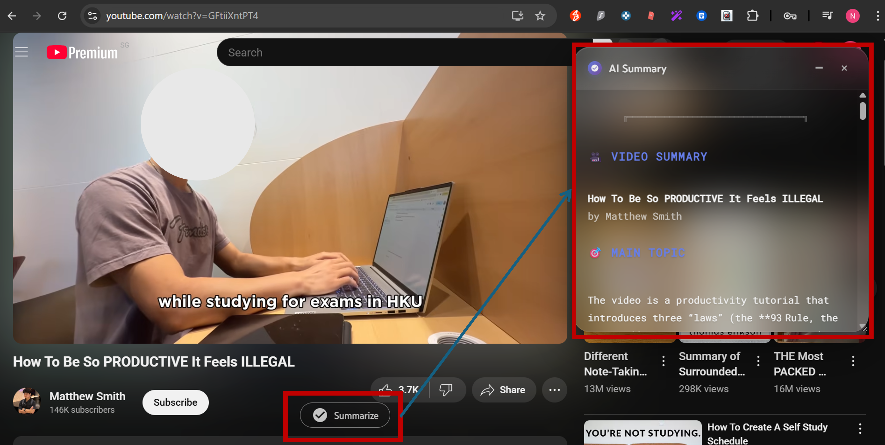
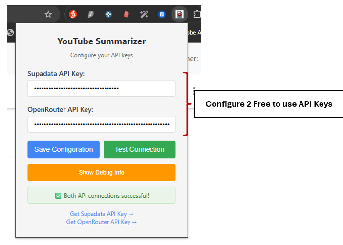

# 📺 YouTube AI Video Summarizer

Transform your YouTube experience with AI-powered video summaries! Get instant insights from any video with our beautiful, modern interface featuring glassmorphism design.

  
  
<em>See the extension in action with its sleek glassmorphism interface</em>

## ✨ Features

- 🎯 **One-Click Summarization** - Elegant "Summarize" button seamlessly integrated with YouTube's interface
- 🤖 **AI-Powered Intelligence** - Uses OpenRouter's advanced models for comprehensive video analysis
- ✨ **Stunning Glassmorphism UI** - Modern frosted glass design with smooth animations and blur effects
- 📋 **Smart Summary Panel** - Organized content with main topics, key points, and structured insights
- 🔄 **Auto-Transcript Extraction** - Automatically extracts and processes video transcripts
- 📱 **Fully Responsive** - Perfect experience across desktop, tablet, and mobile devices
- 🔒 **Privacy First** - All processing happens securely with no data collection

## 🎬 How It Works

1. **Navigate** to any YouTube video
2. **Click** the "Summarize" button next to like/share
3. **Watch** as the beautiful summary panel appears with organized insights
4. **Enjoy** structured summaries with main topics and key takeaways

## 🚀 Installation

### Chrome Web Store (Recommended)
[Install from Chrome Web Store](https://chromewebstore.google.com/detail/mdlhkoefahbnnlgkmiicjhnadmmigofb)

### Manual Installation
1. Clone this repository
2. Open `chrome://extensions/`
3. Enable "Developer mode"
4. Click "Load unpacked" and select the folder

## 🎯 Setup

1. **Get API Keys**:
   - [Supadata API](https://supadata.ai) - for transcript extraction
   - [OpenRouter API](https://openrouter.ai) - for AI summarization (free)

2. **One-Time Configuration**: Click the extension icon to open the setup panel

  
  
<em>Simple one-time setup with your API keys</em>

3. **Enter Your Keys**: Paste your API keys and click "Save Configuration"

4. **Test Connection**: Use "Test Connection" to verify everything works

5. **Start Summarizing**: Go to any YouTube video and click "Summarize"!

## 🔧 How It Works

1. Detects YouTube videos and adds summarize button
2. Extracts transcripts via Supadata API
3. Generates AI summaries using OpenRouter
4. Displays in beautiful glassmorphism UI below video

## 🔒 Privacy & Security

- ✅ No data collection or tracking
- ✅ API keys stored locally in Chrome
- ✅ Encrypted HTTPS connections only
- ✅ Open source and transparent

## 🤝 Contributing

1. Fork the repository
2. Create feature branch (`git checkout -b feature/name`)
3. Commit changes (`git commit -m 'Add feature'`)
4. Push to branch (`git push origin feature/name`)
5. Open Pull Request

## 📝 License

MIT License - see [LICENSE](LICENSE) file for details.

---

**Made with ❤️ by [Naveen U](https://github.com/unaveenj)**